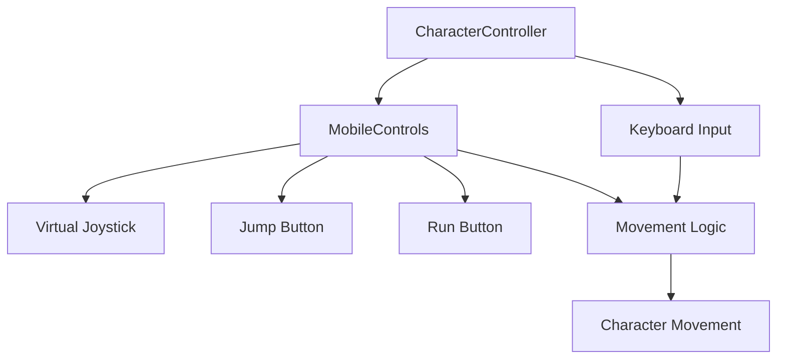

# Mobile Controls Implementation Guide

## Overview

This project now supports **mobile touch controls** alongside keyboard controls for desktop. The implementation automatically detects the device type and shows/hides controls accordingly.

---

## Features

✅ **Virtual Joystick** - Left side of screen for movement  
✅ **Jump Button** - Right side top button (↑)  
✅ **Run Button** - Right side bottom button (⚡)  
✅ **Auto-detection** - Controls hidden on desktop, shown on mobile  
✅ **Smooth Movement** - Normalized joystick input for consistent speed  
✅ **Dual Input Support** - Both keyboard and touch work simultaneously

---

## How It Works

### For Players

**Desktop:**
- **WASD** or **Arrow Keys**: Move character
- **Shift**: Run (2x speed)
- **Space**: Jump

**Mobile:**
- **Left Joystick**: Drag to move in any direction
- **⚡ Button**: Hold to run
- **↑ Button**: Tap to jump

### For Developers

The mobile controls are implemented in two files:

1. **`src/utils/MobileControls.ts`** - Standalone mobile controls utility
2. **`src/models/CharacterController.ts`** - Integrated with character controller

---

## Architecture



---

## Usage Example

### Basic Setup (Already Done in Main.ts)

```typescript
import { CharacterController } from './models/CharacterController';

// Mobile controls are enabled by default
const controller = new CharacterController(
  character,
  camera,
  5,     // moveSpeed
  3,     // rotationSpeed
  true   // enableMobileControls (default: true)
);
```

### Disable Mobile Controls

```typescript
// If you want keyboard-only controls
const controller = new CharacterController(
  character,
  camera,
  5,
  3,
  false  // Disable mobile controls
);
```

---

## Customization

### Adjust Joystick Sensitivity

Edit `src/utils/MobileControls.ts`:

```typescript
private joystickRadius: number = 50; // Change to 30-80 for different sensitivity
```

### Change Button Positions

Edit the `createJumpButton()` and `createRunButton()` methods:

```typescript
button.style.bottom = '140px'; // Adjust vertical position
button.style.right = '80px';   // Adjust horizontal position
```

### Customize Button Appearance

Modify the styles in the button creation methods:

```typescript
button.style.backgroundColor = 'rgba(0, 255, 0, 0.5)'; // Green buttons
button.style.fontSize = '32px'; // Larger icons
```

---

## Advanced: Custom Mobile Controls

If you want to create completely custom mobile controls:

```typescript
import { MobileControls } from './utils/MobileControls';

// Create standalone mobile controls
const mobileControls = new MobileControls();

// In your animation loop
function animate() {
  // Check if moving
  if (mobileControls.isMoving()) {
    const direction = mobileControls.getMovementDirection(camera);
    character.position.add(direction.multiplyScalar(speed * delta));
  }
  
  // Check jump
  if (mobileControls.isJumping) {
    // Handle jump
  }
  
  // Check run
  if (mobileControls.isRunning) {
    // Handle run speed
  }
}

// Cleanup
mobileControls.dispose();
```

---

## Mobile-Specific Optimizations

### 1. Prevent Page Scrolling

Already implemented in `MobileControls.ts`:

```typescript
this.canvas.addEventListener('touchstart', (e) => e.preventDefault(), { passive: false });
```

### 2. CSS Touch Action

Add to your `style.css`:

```css
body {
  touch-action: none; /* Prevents default touch behaviors */
}

canvas {
  touch-action: none; /* Prevents scrolling/zooming on canvas */
}
```

### 3. Viewport Meta Tag

Ensure your `index.html` has:

```html
<meta name="viewport" content="width=device-width, initial-scale=1.0, maximum-scale=1.0, user-scalable=no">
```

---

## Testing

### Desktop Testing
1. Run `bun run dev`
2. Open browser to `localhost:5173`
3. Controls should be **hidden**
4. Use WASD/Arrow keys

### Mobile Testing

**Option 1: Chrome DevTools**
1. Open Chrome DevTools (F12)
2. Toggle device toolbar (Ctrl+Shift+M)
3. Select a mobile device (e.g., iPhone 12)
4. Refresh page - controls should appear

**Option 2: Real Device**
1. Run `bun run dev`
2. Get your local IP: `ipconfig` (Windows) or `ifconfig` (Mac/Linux)
3. On mobile, visit `http://[YOUR_IP]:5173`
4. Controls should appear automatically

---

## Troubleshooting

### Controls Not Showing on Mobile

**Check user agent detection:**
```typescript
// In MobileControls.ts, temporarily disable auto-hide
private hideControlsOnDesktop(): void {
  // Comment out this line to always show controls
  // if (!isMobile) { ... }
}
```

### Joystick Not Responding

- Ensure `touch-action: none` is set in CSS
- Check browser console for errors
- Verify touch events aren't being blocked by other elements

### Poor Performance on Mobile

- Reduce shadow quality in Scene settings
- Lower renderer pixel ratio to 1
- Simplify 3D models (reduce poly count)

### Controls Interfering with Page

- Make sure joystick has `pointerEvents: 'none'` on base/stick
- Buttons should have proper `touchAction: 'none'`
- Check z-index conflicts with other UI

---

## API Reference

### MobileControls Class

#### Properties
- `direction: THREE.Vector2` - Current joystick direction (-1 to 1)
- `isJumping: boolean` - Jump button state
- `isRunning: boolean` - Run button state

#### Methods
- `getMovementDirection(camera: THREE.Camera): THREE.Vector3` - Get world-space movement
- `isMoving(): boolean` - Check if joystick is active
- `consumeJump(): boolean` - Single-use jump input
- `dispose(): void` - Cleanup resources

---

## Future Enhancements

Potential improvements for mobile controls:

- [ ] Haptic feedback on button press
- [ ] Customizable control layouts
- [ ] Gyroscope camera control
- [ ] Touch sensitivity settings UI
- [ ] Multi-touch gesture support (pinch to zoom)
- [ ] Persistent control preferences (localStorage)

---

## Related Files

- [`src/utils/MobileControls.ts`](file:///c:/Users/Admin/Documents/GitHub/3D-home/src/utils/MobileControls.ts) - Mobile controls implementation
- [`src/models/CharacterController.ts`](file:///c:/Users/Admin/Documents/GitHub/3D-home/src/models/CharacterController.ts) - Character controller with mobile support
- [`src/style.css`](file:///c:/Users/Admin/Documents/GitHub/3D-home/src/style.css) - CSS styling (add touch-action rules)

---

## Credits

Mobile controls implementation uses:
- **Three.js** touch interaction patterns
- **Context7** documentation for best practices
- Virtual joystick pattern from mobile game development standards
